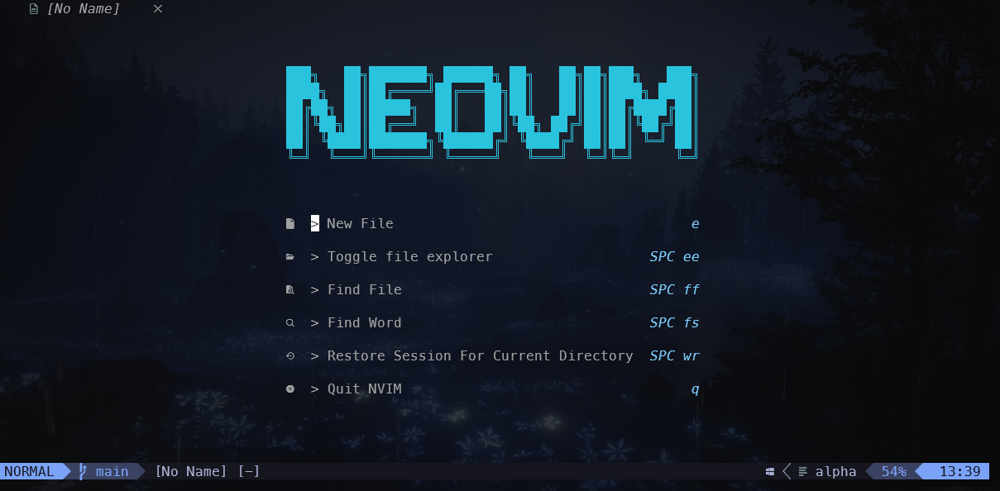

# My Neovim Configuration

This repository contains my comprehensive Neovim configuration, which is designed to boost productivity and streamline development. It includes support for multiple languages, advanced debugging, automated formatting and linting, and a range of UI enhancements. The configuration is modular and leverages lazy-loading for optimal performance.

## Features

- **LSP Integration & Code Intelligence:**

  - Uses `nvim-lspconfig` for language server management.
  - Integrated with Mason for installing and managing language servers (e.g., TypeScript, JavaScript, JSON, and Java via JDTLS).
  - Custom key mappings for navigating definitions, references, and code actions.

- **Debugging (DAP):**

  - Configured with `nvim-dap` and `nvim-dap-ui` to enable in-editor debugging for JavaScript, TypeScript, and Java.
  - Supports breakpoints, step-over/into/out, and other debugging commands.

- **Auto-Formatting & Linting:**

  - Uses `conform.nvim` for code formatting across various file types.
  - Integrates `nvim-lint` for real-time linting feedback.

- **User Interface Enhancements:**

  - Aesthetic themes (e.g., `tokyonight.nvim`) with a transparent background option.
  - Custom dashboards with `alpha-nvim` and a modern statusline via `lualine.nvim`.
  - Notifications powered by `nvim-notify`.

- **File & Project Management:**

  - File explorer with `nvim-tree.lua` and buffer management using `bufferline.nvim`.
  - Project detection and management with `project.nvim` integrated with Telescope.
  - Fuzzy finding for files and text using `telescope.nvim`.

- **Editing and Navigation Improvements:**
  - Auto-pairs with `nvim-autopairs` and advanced commenting via `Comment.nvim`.
  - Enhanced substitution and surrounding operations.
  - Quick file navigation with `harpoon` and Git integration via `gitsigns.nvim`.
  - Additional utilities like `diffview.nvim`, `lazygit.nvim`, and `which-key.nvim` for keybinding hints.
